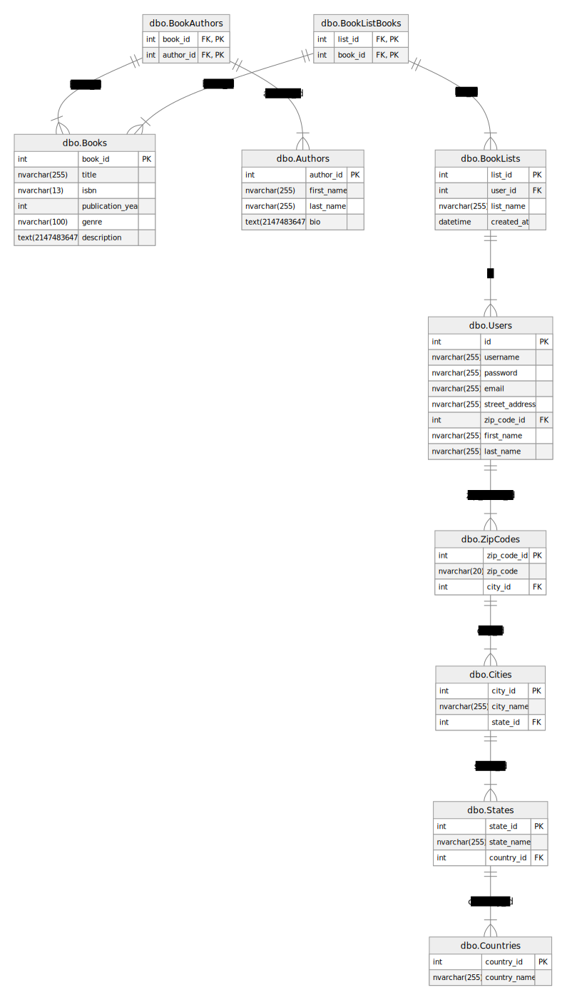

# BookBash

ook Bash is an API built with ASP.NET that allows users to create and manage booklists. Through this API, users can add books, authors, and create book lists. The API provides a simple way to organize books by associating them with different lists, and authors can be linked to their respective books.

## Project Members
- Steve Burgos

## Project Requirements
- README that describes the application and its functionalities
- ERD of your DB
- The application should be ASP.NET Core application
- The application should build and run
- The application should have unit tests and at least 20% coverage (at least 5 unit tests that tests 5 different methods/functionality of your code)
- The application should communicate via HTTP(s) (Must have POST, GET, DELETE)
- The application should be RESTful API
- The application should persist data to a SQL Server DB
- The application should communicate to DB via EF Core (Entity Framework Core)
## Tech Stack

- C# (Back End Programming Language)
- SQL Server (Azure Hosted)
- EF Core (ORM Tech)
- ASP.NET (Web API Framework)

## User Stories
- User should be able to create Books
- User should be able to read Books
- User should be able to delete Books
- User should be able to create Authors
- User should be able to read Authors
- User should be able to delete Authors
- User should be able to create Lists
- User should be able to read Lists
- User should be able to delete Lists

## Tables

## MVP Goals
- User(s) can search books
- User(s) can create lists
- User(s) can search books by authors

## Stretch Goals
- Impliment authentication with password